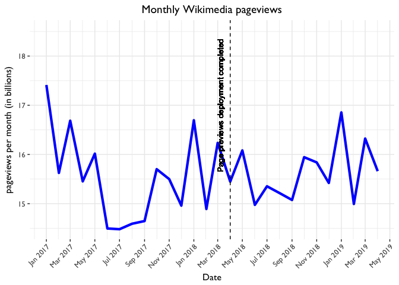
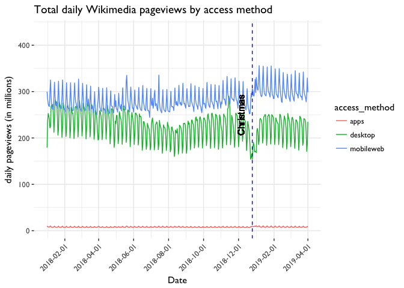
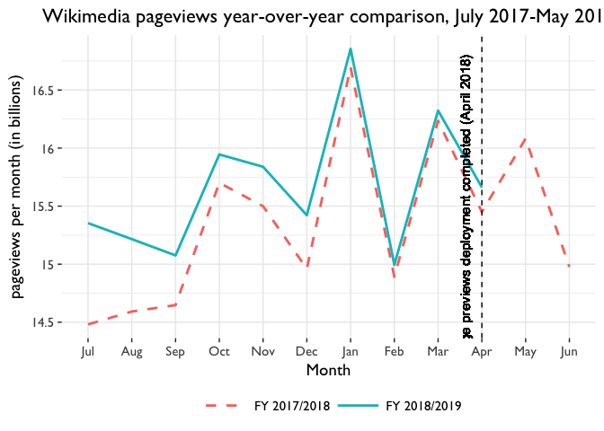
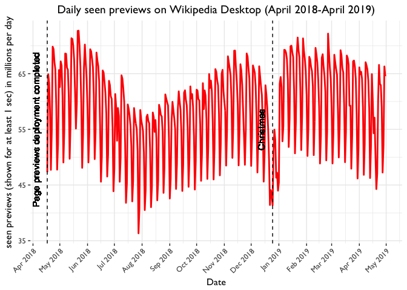
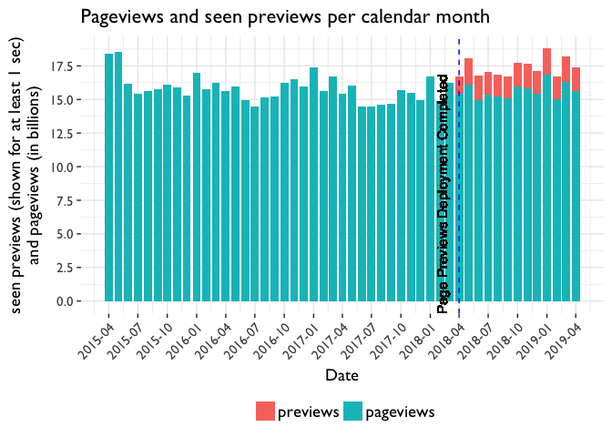

Monthly Readers Interactions
================

TODOs

-   Move process to SWAP noteboook.
-   Further work needed to automate and streamline the process.
-   Note monthly values are based on calendar month. They are no longer normalized due to 30 days.
-   Note: Various IE adjustments and corrections made for previous years. (IEPKIRAF: since May 20, 2018, IE7PKIRAF: January 1-May 19, 2018, IE7PKIRAF & iOS mainpage: ...-Dec 31, 2017)

``` r
library(tidyverse)
library(ggplot2)
library(lubridate)
library(scales)
library(reshape2)
```

Monthly Pageviews
-----------------

``` r
# Get overall pageviews in the month (all wikis, global) with IE correction
# applied for post May 20, 2018 dates. Other corrections applied for earlier
# dates.
query <- "
SELECT year, month, day, CONCAT(year,'-',LPAD(month,2,'0'),'-',LPAD(day,2,'0')) AS date,
SUM(view_count) as all
FROM wmf.pageview_hourly
WHERE ((year = 2018 AND month >= 5) OR (year >= 2019))
AND agent_type='user'
AND NOT (country_code IN ('PK', 'IR', 'AF') -- https://phabricator.wikimedia.org/T157404#3194046
         AND user_agent_map['browser_family'] = 'IE') -- https://phabricator.wikimedia.org/T193578#4300284
GROUP BY year, month, day ORDER BY year, month, day LIMIT 1000;
"
results <- collect(sql(query))
# add results to pageviews.tsv file which includes corrected data for
# pre-May 2018 dates. TODO: Add other queries with corrections for earlier
# dates to automate this process
```

``` r
# Read in pageviews data with all corrected data (dating back to 2015-04-01)
pageviews_all <- read.delim("data/pageviews.tsv", sep = "\t")
pageviews_all$date <- as.Date(pageviews_all$date, format = "%Y-%m-%d")
```

Find total pageviews per month with yoy changes

``` r
pageviews_all_monthly <- pageviews_all %>% mutate(date = floor_date(date, "month")) %>% 
    group_by(date) %>% summarise(monthly_views = sum(as.numeric(total))/1e+09) %>% 
    arrange(date) %>% mutate(yearOverYear = monthly_views/lag(monthly_views, 
    12) - 1) %>% mutate(type = "pageviews")

tail(pageviews_all_monthly)
```

    ## # A tibble: 6 x 4
    ##         date monthly_views yearOverYear      type
    ##       <date>         <dbl>        <dbl>     <chr>
    ## 1 2018-11-01      15.83887  0.021906138 pageviews
    ## 2 2018-12-01      15.42157  0.030803389 pageviews
    ## 3 2019-01-01      16.85442  0.009529791 pageviews
    ## 4 2019-02-01      14.99445  0.006880624 pageviews
    ## 5 2019-03-01      16.32313  0.005428818 pageviews
    ## 6 2019-04-01      15.66120  0.013725208 pageviews

Create time series chart of monthly pageviews

``` r
p <- ggplot(pageviews_all_monthly, aes(x = date, y = monthly_views)) + geom_line(color = "blue", 
    size = 1.5) + geom_vline(xintercept = as.numeric(as.Date("2018-04-01")), 
    linetype = "dashed", color = "black") + geom_text(aes(x = as.Date("2018-04-01"), 
    y = 17, label = "Page previews deployment completed"), size = 3.5, vjust = -1.2, 
    angle = 90, color = "black") + scale_y_continuous("pageviews per month (in billions)", 
    labels = polloi::compress) + scale_x_date("Date", labels = date_format("%b %Y"), 
    date_breaks = "2 months", limits = as.Date(c("2017-01-01", "2019-04-01"))) + 
    labs(title = "Monthly Wikimedia pageviews") + ggthemes::theme_tufte(base_size = 12, 
    base_family = "Gill Sans") + theme(axis.text.x = element_text(angle = 45, 
    hjust = 1), plot.title = element_text(hjust = 0.5), panel.grid = element_line("gray70"))

ggsave(filename = "Monthly pageviews monthly time series.png", plot = p, path = "figures", 
    units = "in", dpi = 150, height = 6, width = 10, limitsize = FALSE)
p
```



### Review pageviews by access method

Calculate desktop pageview and year over year comparison

``` r
pageviews_desktop <- pageviews_all %>%
  mutate(date = floor_date(date, "month")) %>%
  select(c(1,3))  %>% #select desktop and date column
  group_by(date) %>%
  summarise(monthly_views = sum(as.numeric(desktop))/1E9) %>%
  arrange(date) %>%
  mutate(yearOveryear = monthly_views/lag(monthly_views,12) -1)

tail(pageviews_desktop)
```

    ## # A tibble: 6 x 3
    ##         date monthly_views yearOveryear
    ##       <date>         <dbl>        <dbl>
    ## 1 2018-11-01      6.922584  -0.07723049
    ## 2 2018-12-01      6.335151  -0.08577541
    ## 3 2019-01-01      6.985972  -0.09409873
    ## 4 2019-02-01      6.264341  -0.09110229
    ## 5 2019-03-01      6.740714  -0.10365101
    ## 6 2019-04-01      6.407008  -0.09409152

Calculate mobile web pageview and year over year comparison

``` r
pageviews_mobileweb <- pageviews_all  %>%
  mutate(date = floor_date(date, "month")) %>%
  select(c(1,4))  %>% #select mobile web and date column
  group_by(date) %>%
  summarise(monthly_views = sum(as.numeric(mobileweb))/1E9) %>%
  arrange(date) %>%
  mutate(yearOveryear = monthly_views/lag(monthly_views,12) -1)

tail(pageviews_mobileweb)
```

    ## # A tibble: 6 x 3
    ##         date monthly_views yearOveryear
    ##       <date>         <dbl>        <dbl>
    ## 1 2018-11-01      8.681663   0.11659640
    ## 2 2018-12-01      8.834867   0.13301848
    ## 3 2019-01-01      9.601004   0.09974684
    ## 4 2019-02-01      8.500268   0.09274550
    ## 5 2019-03-01      9.330934   0.10112440
    ## 6 2019-04-01      9.013610   0.10659948

Quality check: Review all access methods together

``` r
pageviews_byaccess <- pageviews_all %>%
  select(-c(5)) %>% #remove total column as it's not needed for this chart
  melt(id.vars = c("date"), measure.vars = c("apps", "desktop", "mobileweb"),
       variable.name = "access_method", value.name = 'views')

p <- ggplot(pageviews_byaccess, aes(x=date, y = (views/1000000), color = access_method)) +  
  geom_line() +
  geom_vline(xintercept = as.numeric(as.Date("2018-12-25")),
             linetype = "dashed", color = "blue") +
  geom_text(aes(x=as.Date('2018-12-25'), y=250, label="Christmas"), size=4, vjust = -1.2, angle = 90, color = "black") +
  scale_y_continuous("daily pageviews (in millions)") +
  scale_x_date("Date", labels = date_format("%Y-%m-%d"), date_breaks = "2 months", limits= as.Date(c("2018-01-01", "2019-04-01"))) +
  labs(title = "Total daily Wikimedia pageviews by access method") +
  ggthemes::theme_tufte(base_size = 12, base_family = "Gill Sans") +
  theme(axis.text.x=element_text(angle = 45, hjust = 1),
        panel.grid = element_line("gray70"))


ggsave(filename="Daily pageviews byaccess method.png", plot = p, path = "figures", units = "in", dpi = 192, height = 6, width = 10, limitsize = FALSE)  
p
```



Create YOY Chart comparing the current fiscal year with the previous fical year.

``` r
# Various adjustments to allow for fiscal year comparison.
pageviews_all_monthly_fy <- pageviews_all_monthly %>% filter(date >= "2017-07-01") %>% 
    mutate(fiscal_year = ifelse(date >= "2017-07-01" & date < "2018-07-01", 
        "FY 2017/2018", "FY 2018/2019"), MonthN = as.factor(format(as.Date(date), 
        "%m")), Month = months(as.Date(date), abbreviate = TRUE))

pageviews_all_monthly_fy$MonthN = factor(pageviews_all_monthly_fy$MonthN, levels = c("07", 
    "08", "09", "10", "11", "12", "01", "02", "03", "04", "05", "06"))


p <- ggplot(pageviews_all_monthly_fy, aes(x = MonthN, y = monthly_views, group = fiscal_year, 
    color = fiscal_year, linetype = fiscal_year)) + geom_line(size = 1) + geom_vline(xintercept = 10, 
    linetype = "dashed", color = "black") + geom_text(aes(x = 10, y = 15.5, 
    label = "Page previews deployment completed (April 2018)"), size = 4, vjust = -1.2, 
    angle = 90, color = "black") + scale_y_continuous("pageviews per month (in billions)", 
    labels = polloi::compress) + scale_x_discrete(breaks = pageviews_all_monthly_fy$MonthN, 
    labels = pageviews_all_monthly_fy$Month) + labs(title = "Wikimedia pageviews year-over-year comparison, July 2017-May 2019") + 
    ggthemes::theme_tufte(base_size = 14, base_family = "Gill Sans") + theme(plot.title = element_text(hjust = 0.5), 
    legend.title = element_blank(), legend.position = "bottom", panel.grid = element_line("gray70"), 
    legend.key.width = unit(1.5, "cm")) + xlab("Month") + scale_linetype_manual(breaks = c("FY 2017/2018", 
    "FY 2018/2019"), values = c(2, 1))

ggsave(filename = "Pageviews_monthly_yoy.png", plot = p, path = "figures", units = "in", 
    dpi = 192, height = 6, width = 10, limitsize = FALSE)
p
```



Monthly Previews on Desktop Wikipedia
-------------------------------------

``` r
# Get daily page previews seen on desktop Wikipedia since deployment in
# April 2018
query <- "
SELECT year, month, day, CONCAT(year,'-',LPAD(month,2,'0'),'-',LPAD(day,2,'0')) AS date,
  SUM(view_count) AS previews_seen
  FROM wmf.virtualpageview_hourly 
  WHERE (year = 2018 AND month >=4) OR (year = 2019)
  GROUP BY year, month, day
  ORDER BY year, month, day LIMIT 10000;
"
results <- collect(sql(query))
save(results, file = "Data/page_previews.tsv")
```

``` r
previews <- read.delim("data/page_previews.tsv", sep = "\t")
previews$date <- as.Date(previews$date, format = "%Y-%m-%d")

previews_all_monthly <- previews %>%
  select(-c(1,2,3)) %>%
  mutate(date = floor_date(date, "month"))  %>%
  filter(date <= '2019-04-01') %>% #Filter out incomplete months
  group_by(date) %>%
  summarise(monthly_views = sum(as.numeric(previews_seen))/1E9) %>%
  arrange(date) %>%
  mutate(yearOverYear= monthly_views/lag(monthly_views,12) -1) %>%
  mutate(type = "previews")

tail(previews_all_monthly)
```

    ## # A tibble: 6 x 4
    ##         date monthly_views yearOverYear     type
    ##       <date>         <dbl>        <dbl>    <chr>
    ## 1 2018-11-01      1.818342           NA previews
    ## 2 2018-12-01      1.681406           NA previews
    ## 3 2019-01-01      1.959036           NA previews
    ## 4 2019-02-01      1.738551           NA previews
    ## 5 2019-03-01      1.867233           NA previews
    ## 6 2019-04-01      1.759067    0.3666783 previews

Chart daily page previews times series

``` r
previews_all_daily <- previews %>% filter(date >= "2018-04-17" & date <= "2019-04-30")  #Filter out dates that occured before page previews rollout was completed.

p <- ggplot(previews_all_daily, aes(x = date, y = (previews_seen/1e+06))) + 
    geom_line(color = "red", size = 1) + geom_vline(xintercept = as.numeric(as.Date("2018-04-17")), 
    linetype = "dashed", color = "black") + geom_vline(xintercept = as.numeric(as.Date("2018-12-25")), 
    linetype = "dashed", color = "black") + geom_text(aes(x = as.Date("2018-12-25"), 
    y = 55, label = "Christmas"), size = 4, vjust = -1.2, angle = 90, color = "black") + 
    geom_text(aes(x = as.Date("2018-04-17"), y = 55, label = "Page previews deployment completed"), 
        size = 4, vjust = -1.2, angle = 90, color = "black") + scale_y_continuous("seen previews (shown for at least 1 sec) in millions per day") + 
    scale_x_date("Date", labels = date_format("%b %Y"), date_breaks = "1 month") + 
    labs(title = "Daily seen previews on Wikipedia Desktop (April 2018-April 2019)") + 
    ggthemes::theme_tufte(base_size = 12, base_family = "Gill Sans") + theme(axis.text.x = element_text(angle = 45, 
    hjust = 1), plot.title = element_text(hjust = 0.5), panel.grid = element_line("gray70"))

ggsave(filename = "Daily page previews seen.png", plot = p, path = "figures", 
    units = "in", dpi = 192, height = 6, width = 10, limitsize = FALSE)
p
```



Monthly Interactions (Pageviews + Seen Previews)
================================================

Combine pageviews and previews data into table

``` r
interactions <- rbind(pageviews_all_monthly, previews_all_monthly)
```

Create stacked bar charts of page interactions

``` r
p <- ggplot(interactions, aes(x = date, y = monthly_views, fill = forcats::fct_rev(type))) + 
    geom_col() + scale_y_continuous("seen previews (shown for at least 1 sec)\nand pageviews (in billions)", 
    breaks = c(seq(0, 20, by = 2.5))) + scale_x_date("Date", labels = date_format("%Y-%m"), 
    date_breaks = "3 months") + geom_vline(xintercept = as.numeric(as.Date("2018-04-01")), 
    linetype = "dashed", color = "blue") + geom_text(aes(x = as.Date("2018-04-01"), 
    y = 8, label = "Page Previews Deployment Completed"), size = 4, vjust = -1.2, 
    angle = 90, color = "black") + labs(title = "Pageviews and seen previews per calendar month") + 
    ggthemes::theme_tufte(base_size = 14, base_family = "Gill Sans") + theme(axis.text.x = element_text(angle = 45, 
    hjust = 1), panel.grid = element_line("gray70"), legend.position = "bottom", 
    legend.title = element_blank(), legend.text = element_text(size = 14))

ggsave(filename = "Pageviews and interactions_StackedBar.png", plot = p, path = "figures", 
    units = "in", dpi = 192, height = 6, width = 10, limitsize = FALSE)
p
```



Calculate total monthly interactions (sum of pageviews and previews) on desktop

``` r
interactions_total <- interactions %>%
  filter(date >= "2018-04-01") %>% #filter to first month previews rolled out.
  group_by(date) %>%
  summarise(interactions = sum(monthly_views)) %>%
  arrange(date) %>%
  mutate(yearOverYear= interactions/lag(interactions,12) -1) 

knitr::kable(interactions_total)
```

| date       |  interactions|  yearOverYear|
|:-----------|-------------:|-------------:|
| 2018-04-01 |      16.73627|            NA|
| 2018-05-01 |      18.04702|            NA|
| 2018-06-01 |      16.75144|            NA|
| 2018-07-01 |      17.01900|            NA|
| 2018-08-01 |      16.86785|            NA|
| 2018-09-01 |      16.71364|            NA|
| 2018-10-01 |      17.75551|            NA|
| 2018-11-01 |      17.65721|            NA|
| 2018-12-01 |      17.10298|            NA|
| 2019-01-01 |      18.81346|            NA|
| 2019-02-01 |      16.73300|            NA|
| 2019-03-01 |      18.19036|            NA|
| 2019-04-01 |      17.42027|     0.0408692|
